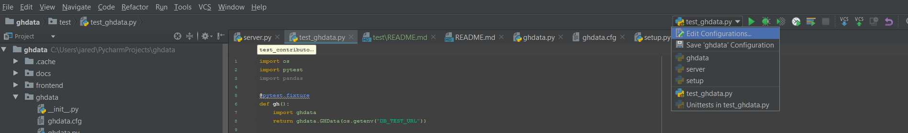
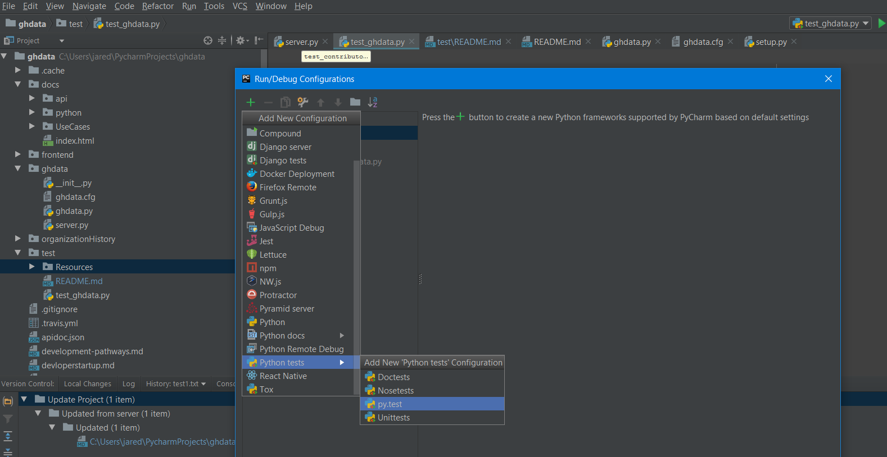
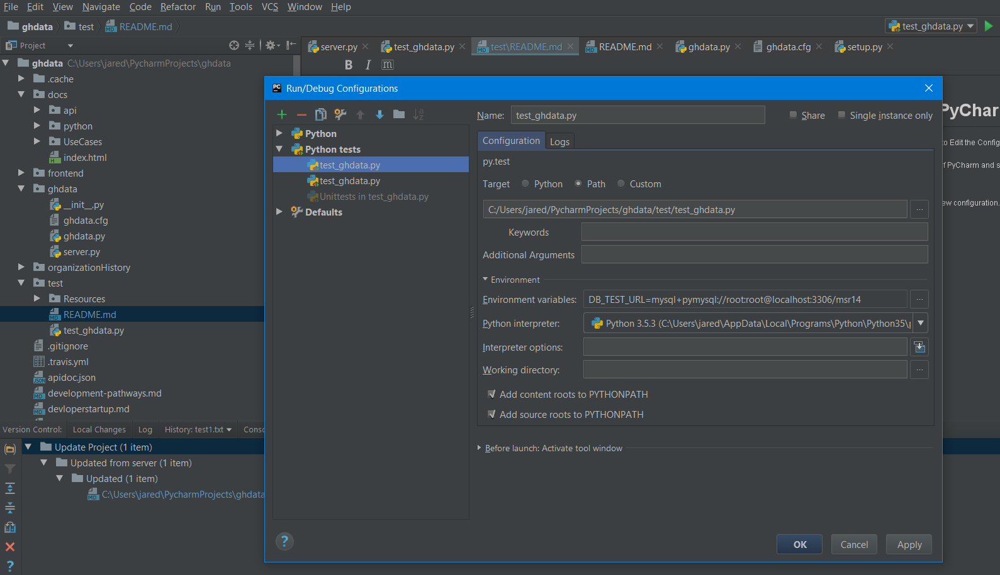

# Running Tests using PyCharm IDE

To run tests for the project in PyCharm you will need to Edit the Configuration for the test_ghdata.py file.

1. Click on the Run file dropdown in the top right of PyCharm and select 'Edit Configuration'

2. Click on the Add button in the top left to add a new configuration. Select "Python test" \> "py.test"

3. Select the Target Path to the location of the test file on your system.
4. Add Your database connection to the Environmental Variables field in the form: `DB_TEST_URL=DB_TEST_URL=mysql+pymysql://{user}:{password}@{host}:{port}/{name}`

5. Click Ok to save your configuration.

6. Select and run the new configuration.

